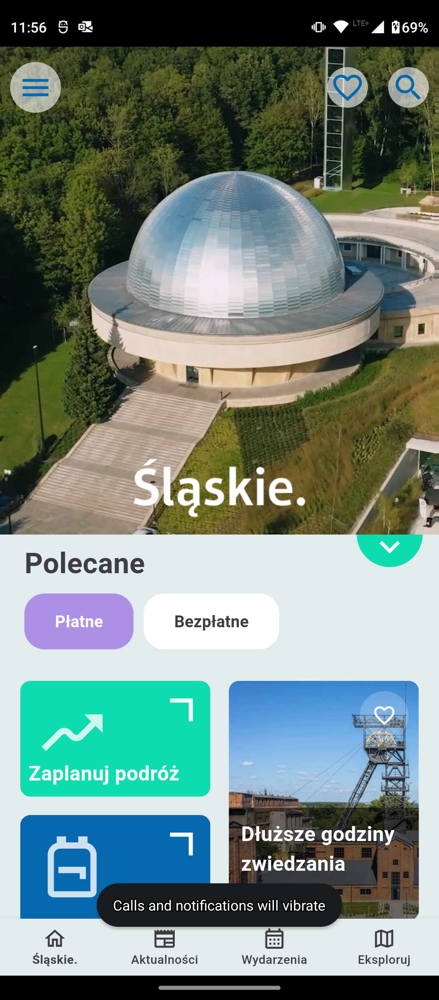
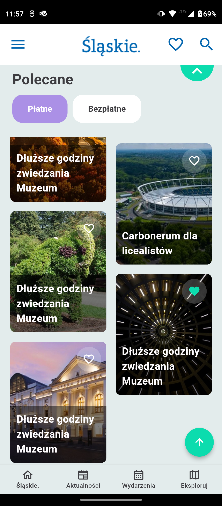

# Silesian Prototype

A Flutter project that recreates a screen for an application dedicated to the Silesian region.

## Target

Below is an animation showing the target appearance of the application:

## Screenshots

Below are screenshots taken directly from the application, showing its actual appearance, captured on a **Motorola Moto G60**:

<table width="100%">
  <tbody>
    <tr>
      <td width="1%"></td>
      <td width="1%"></td>
    </tr>
  </tbody>
</table>

## Tech Stack

This project uses the following technologies:

- **Flutter**
- **Dart**
- **Freezed**
- **flutter_bloc**
- **video_player**
- **flutter_staggered_grid_view**

## Setup

Run the following commands from your terminal:

1) `git clone https://github.com/wieczorek0807/silesian_prototype.git` to clone this repository.
2) `flutter pub get` in the project root directory to install all the required dependencies.
3) `flutter pub run build_runner build --delete-conflicting-outputs` to generate Freezed files.
